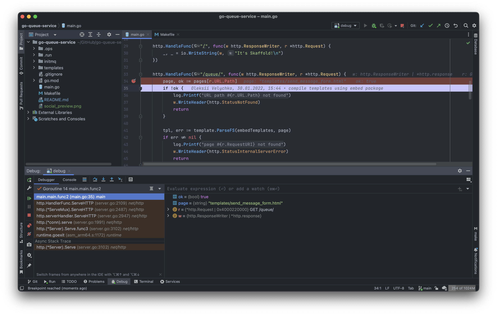

# go-queue-service

### Local Kubernetes development environment is running on Skaffold and handles queue service.

📌 Use <a href="https://raw.githubusercontent.com/oleksiivelychko/laravel-starter-kit/main/.docker/shell/generate-certs.sh">generate-certs.sh</a> to generate certificate:
```
./generate-certs go-queue-service.local
```

📌 In order to debug:
- `make skaffold-debug`
- run `debug` configuration in GoLand
- add breakpoints
- visit `go-queue-service.local/queue`

💡 To show all available logs in **k9s**: set `k9s.logger.sinceSeconds` to `-1` (use `k9s info` to find config location).


